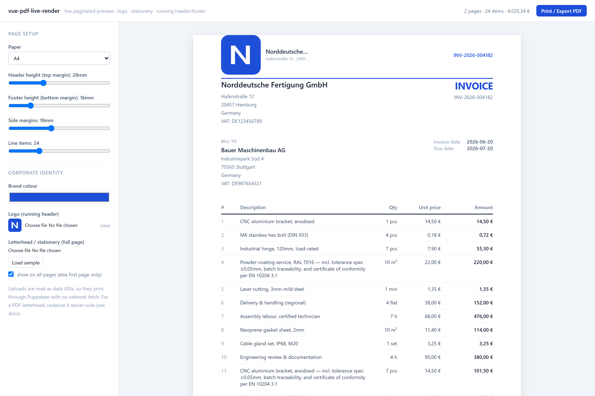
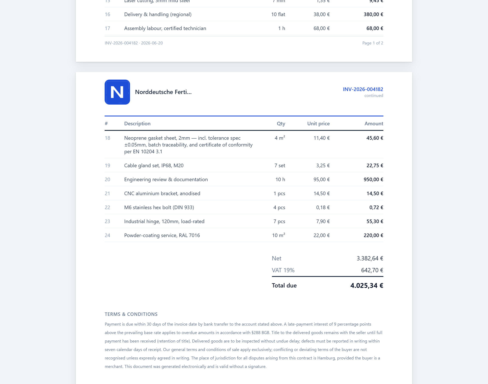
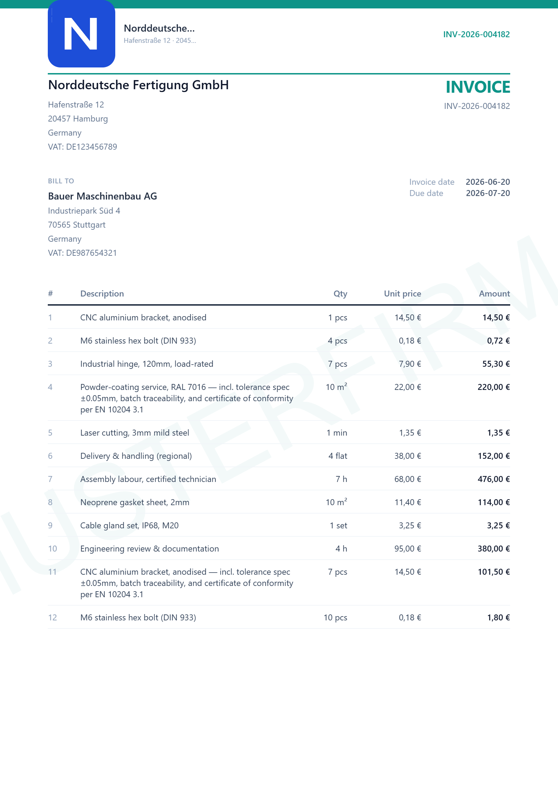

# vue-pdf-live-render

[](https://www.npmjs.com/package/@nfpocket/pdf-rendering-engine) [](LICENSE) [](https://stackblitz.com/edit/nfpocket-pdf-rendering-engine-vue?file=src%2FApp.vue)

> Install as **`@nfpocket/pdf-rendering-engine`**.

A **live-preview pagination engine** for Vue 3 + Tailwind documents — invoices,
offers, delivery notes, purchase orders. Word-style multi-page layout with
**running headers/footers, page numbers, and an instant on-screen preview of
real page breaks**, while the content stays real Vue components styled with real
Tailwind, and the **final PDF is produced by Puppeteer from the same DOM**.



**▶ [Try it live on StackBlitz](https://stackblitz.com/edit/nfpocket-pdf-rendering-engine-vue?file=src%2FApp.vue)** — runs in your browser, edit `src/App.vue`, no install.

This is the prototype / walking skeleton (milestone **M1**). See
[`docs/ARCHITECTURE.md`](docs/ARCHITECTURE.md) for the full design and roadmap.

<table>
  <tr>
    <td width="50%" valign="top">
      <br/>
      <sub><b>Real page breaks.</b> The line-item table splits between rows and repeats its header on the next page; footers carry live page numbers.</sub>
    </td>
    <td width="50%" valign="top">
      <br/>
      <sub><b>Corporate identity.</b> Per-tenant brand colour, an uploaded logo in the running header, and a full-page letterhead/stationery layer.</sub>
    </td>
  </tr>
</table>

## Install & use

```bash
npm i @nfpocket/pdf-rendering-engine vue
```

```ts
// once, anywhere in your app — ships the .vplr-* base styles:
import '@nfpocket/pdf-rendering-engine/style.css'
```

This stylesheet is **required and self-contained**: the engine's page layout
does not depend on Tailwind. Tailwind (if you use it) only styles *your* document
content in the slots.

```vue
<script setup lang="ts">
import { reactive } from 'vue'
import { PaginatedDocument } from '@nfpocket/pdf-rendering-engine'

const doc = reactive({ /* your reactive model */ })
</script>

<template>
  <PaginatedDocument :model="doc" paper="A4" :margins-mm="{ top: 22, right: 18, bottom: 16, left: 18 }">
    <template #document><!-- the WHOLE document, tagged with data-atom-* --></template>
    <template #page="{ fragments }"><!-- render each computed fragment --></template>
    <template #footer="{ pageNumber, totalPages }">Page {{ pageNumber }} / {{ totalPages }}</template>
  </PaginatedDocument>
</template>
```

Vue **3.4+** is a peer dependency. The package is ESM + TypeScript types,
Chromium-targeted (the same DOM drives the on-screen preview and the Puppeteer
print). The full, copy-pasteable walkthrough is in
**[Tutorial](#tutorial-paginate-your-own-document)** below.

## Develop this repo

```bash
npm install
npm run dev         # the live invoice demo at http://localhost:5173
npm run build       # build the publishable library → dist/ (ESM + .d.ts + style.css)
npm run build:demo  # build the demo app → dist-demo/
npm run typecheck   # types only
npm run screenshots # regenerate the README screenshots (needs `npm run dev` running)
```

In the demo, drag the **Line items** slider (or change paper, margins, tax rate,
brand colour, logo) and watch the page count, page breaks, repeated table header
and footer page numbers re-flow **live** — no regenerate step. Click **Print /
Export PDF** to open the print DOM (Ctrl/Cmd-P → Save as PDF) — that same DOM is
what you'd POST to your Puppeteer `/print` endpoint (see
[`server/print.example.mjs`](server/print.example.mjs)).

## What works today (M1)

- A4/Letter/Legal geometry in exact fractional px; configurable margins.
- Measurement-driven fragmentation: **block**, **table-row** (with repeated
  `<thead>` on every page), and **text** (line-boundary) splitting.
- Single off-canvas **galley** rendered once; pages are a projection of measured
  layout data. Component instances are never moved.
- Running header/footer chrome + live **"Page X of Y"**.
- Minimum-progress invariant (never deadlocks, never drops content).
- Live re-pagination on any data/geometry change.
- **"Preview IS the print"** export: the rendered pages (chrome + page numbers)
  are serialized one `<div>` per sheet with `@page { margin: 0 }` and printed via
  the browser or your Puppeteer `/print` endpoint — headers/footers/margins
  identical to the preview. (Keep the print dialog's margins on **Default**.)

## Tutorial: paginate your own document

### The mental model — two render paths, one content

`PaginatedDocument` works by rendering your content **twice**, for two different
jobs. The demo shows each job in its own file:

| File | Slot | Job |
|------|------|-----|
| [`demo/InvoiceDoc.vue`](src/demo/InvoiceDoc.vue) | `#document` | **The galley.** Renders the *whole* document, once, continuously, off-canvas. Each measurable unit is tagged with `data-atom-*` so the engine can measure it and decide where pages break. The user never sees this directly. |
| [`demo/FragmentView.vue`](src/demo/FragmentView.vue) | `#page` | **The projection.** Given one computed *fragment* of the layout, renders just that piece onto a page (a whole block, a table's row-slice with a repeated header, or a clipped slice of text). This is what the user sees and what prints. |

The flow: your `#document` markup → measured → `paginate()` produces a
`PageLayout[]` (which fragments go on which page) → your `#page` slot draws each
fragment. **Both slots must render the same content identically per unit** (the
galley and the page use the same components/markup), so the measured height
matches the displayed height. For a plain block the two are literally the same
component; only *splittable* atoms (tables, text) need slice parameters in the
page slot.

> Why twice? The galley must be real, fully-rendered DOM so the browser gives us
> true Tailwind geometry to measure (no PDF style dialect). Hand-writing the
> `#page` slice renderer is an M1 ergonomic wart — milestone **M4** (clip-window
> projection of the single galley) removes it. For now, it's two small slots.

### A minimal document

```vue
<script setup lang="ts">
import { reactive } from 'vue'
import { PaginatedDocument } from './engine-vue'

const doc = reactive({
  title: 'Delivery Note',
  rows: Array.from({ length: 40 }, (_, i) => ({ id: `r${i}`, name: `Item ${i + 1}`, qty: i + 1 })),
})
</script>

<template>
  <PaginatedDocument
    :model="doc"
    paper="A4"
    :margins-mm="{ top: 22, right: 18, bottom: 16, left: 18 }"
  >
    <!-- (1) THE GALLEY: the whole document, once, with data-atom-* tags -->
    <template #document>
      <h1 data-atom-id="title" data-atom-kind="block" class="pb-4 text-xl font-bold">
        {{ doc.title }}
      </h1>

      <table data-atom-id="rows" data-atom-kind="table" class="w-full table-fixed text-sm">
        <thead data-thead>
          <tr><th class="text-left">Item</th><th class="text-right">Qty</th></tr>
        </thead>
        <tbody>
          <tr v-for="r in doc.rows" :key="r.id" :data-row-id="r.id">
            <td>{{ r.name }}</td>
            <td class="text-right">{{ r.qty }}</td>
          </tr>
        </tbody>
      </table>
    </template>

    <!-- (2) THE PAGE: render each computed fragment, mirroring the galley -->
    <template #page="{ fragments }">
      <template v-for="(f, i) in fragments" :key="i">
        <h1 v-if="f.kind === 'block' && f.atomId === 'title'" class="pb-4 text-xl font-bold">
          {{ doc.title }}
        </h1>

        <table v-else-if="f.kind === 'table'" class="w-full table-fixed text-sm">
          <thead><tr><th class="text-left">Item</th><th class="text-right">Qty</th></tr></thead>
          <tbody>
            <!-- only THIS page's rows; the <thead> above repeats automatically -->
            <tr v-for="r in doc.rows.slice(f.fromRow, f.toRow)" :key="r.id">
              <td>{{ r.name }}</td>
              <td class="text-right">{{ r.qty }}</td>
            </tr>
          </tbody>
        </table>
      </template>
    </template>

    <!-- (3) OPTIONAL running chrome (repeats on every sheet) -->
    <template #footer="{ pageNumber, totalPages }">
      <div class="flex h-full items-start justify-between border-t pt-2 text-[10px] text-slate-400">
        <span>{{ doc.title }}</span>
        <span>Page {{ pageNumber }} of {{ totalPages }}</span>
      </div>
    </template>
  </PaginatedDocument>
</template>
```

That's a complete, paginating, printable document. Change `doc.rows.length` and
it re-flows live.

### Reference

**Props**

| Prop | Type | Notes |
|------|------|-------|
| `model` (required) | any reactive object | Deep-watched; any change re-paginates. |
| `paper` | `'A4' \| 'Letter' \| 'Legal' \| {width,height}` | Default `'A4'`. |
| `orientation` | `'portrait' \| 'landscape'` | Default `'portrait'`. |
| `marginsMm` | `{ top, right, bottom, left }` (mm) | **`top` = running-header band height; `bottom` = footer band height.** Grow `top` to fit a taller logo. |
| `gap` | number (px) | On-screen gap between sheets. |
| `themeVars` | `Record<string,string>` | CSS vars applied to galley **and** pages, e.g. `{ '--brand': '#b91c1c' }`. |

**Slots** (all scoped slots receive `{ pageNumber, totalPages, isFirstPage }`; `#page` also gets `fragments`)

| Slot | Required | Renders |
|------|----------|---------|
| `#document` | ✅ | The galley (whole doc, `data-atom-*` tagged). |
| `#page` | ✅ | One page's fragments. |
| `#header` / `#footer` | optional | Running chrome in the top/bottom margins. |
| `#background` | optional | Full-bleed layer behind content (stationery/letterhead). |

**Galley annotations** (on elements in `#document`)

| Attribute | On | Meaning |
|-----------|----|---------|
| `data-atom-id` | every atom | Stable id from your model (not DOM identity). **Required.** |
| `data-atom-kind` | every atom | `"block"` \| `"table"` \| `"text"`. |
| `data-break-before` | any atom | Force a page break before it. |
| `data-keep-with-next` | any atom | Keep on the same page as the following atom. |
| `data-thead` / `data-tfoot` | inside a `table` atom | Header repeated / footer reserved on each fragment. |
| `data-row-id` | each `<tr>` in a `table` atom | Per-row id; tables split between rows. |
| `data-orphans` / `data-widows` | a `text` atom | Min lines kept together at a break (default 2/2). A `text` atom must be a single run of inline text. |

**Fragment shapes** (what `#page` receives, from [`core/types.ts`](src/core/types.ts))

```ts
{ kind: 'block', atomId }
{ kind: 'table', atomId, fromRow, toRow, repeatHeader, continued }
{ kind: 'text',  atomId, fromLine, toLine, clipTop, clipHeight, continued }
```

For a **text** fragment, render the *whole* paragraph inside a clip window
(`height: clipHeight; overflow: hidden` → inner `transform: translateY(-clipTop)`),
as in [`FragmentView.vue`](src/demo/FragmentView.vue).

### Three rules that bite if ignored

1. **Spacing must live inside the atom box.** v1 measures border-box height and
   ignores margins *between* atoms. Put inter-atom spacing as `padding`
   (the demo uses `pb-*`/`pt-*`), or pages won't match the galley.
2. **Stable ids, not indexes.** `data-atom-id` / `data-row-id` should come from
   your model so incremental re-pagination (M3) can match across edits.
3. **The two slots must agree.** Same component, same width, same styles in
   `#document` and `#page`, or measured height ≠ rendered height.

## What's next

M2 robust fragmentation (rowspan, flex/grid, decoration-across-cut, break
scoring) → M3 incremental reflow → M4 live clip-window projection (removes the
hand-written `#page` slot) → M5 full WYSIWYG editing. See the roadmap in
[`docs/ARCHITECTURE.md`](docs/ARCHITECTURE.md).

## Layout

```
src/
  core/         framework-agnostic pagination core — NO Vue, NO DOM (OSS-extractable)
    geometry.ts   page sizes, px/mm, content box, EPSILON
    types.ts      Atom / Fragment / PageLayout / BreakToken contract
    fragment.ts   paginate(atoms, contentHeight) → PageLayout[]  (the heart)
    export.ts     @page + break-before CSS builders
  engine-vue/   the Vue binding (the only Vue/DOM-aware layer)
    measure.ts            galley DOM → Atom[] (the only measurement code)
    usePagination.ts      fonts-gated, rAF-batched, reactive scheduler
    PaginatedDocument.vue galley mount + page projection + chrome slots
    printExport.ts        buildPrintHtml() + printViaBrowser()
  demo/         a live invoice (model, blocks, FragmentView page renderer)
server/
  print.example.mjs   example Puppeteer /print endpoint
docs/
  ARCHITECTURE.md     the full synthesized design + roadmap
```
